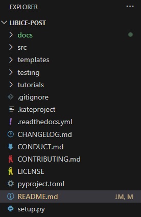

# libICEpost

Postprocessing of data sampled from internal combustion engines (Experimental, 1D/0D (Gasdyn/GT-Power), 3D (LibICE-OpenFOAM/commercial codes), etc.)

## Installation

### Requirements

####  Conda

Suggested to use [Anaconda](https://www.anaconda.com/) python environment manager to use the library, so that the correct python version can be used in a dedicated environment. Currently working on python version 3.11.4.

> [!NOTE]  
> When you install conda (eg. `C:\Users\your_name\anaconda3`), go in the installation directory, open a Windows terminal in that folder and execute the script:

```bash
Scripts\conda.exe init
```

Open a new terminal in the folder and execute the following line:

```bash
conda install python==3.11
```

to install Python 3.11, which is required.
####  Visual Studio Code
Installation of [Visual Studio Code](https://code.visualstudio.com) (VS Code) is suggested. Follow the instructions to install the program. The following extension for Python has to be installed [Python Extension Pack](https://marketplace.visualstudio.com/items?itemName=donjayamanne.python-extension-pack). 

> [!NOTE]
> In VS Code the Python interpreter has to be selected. To do so, use `Ctrl+Maiusc+P`, search for `Python: Select Interpreter` and then select the available Python interpreter.

####  GIT
[GIT](https://git-scm.com/downloads/win) is necessary to download the repository. Follow the instructions to install the program. No further action are necessary.

### Installing from PyPI (_skip for ICEGroup_)

Installation from PyPI repositories (not up-to-date):

```bash
pip install libICEpost
```

### Downloading and installing the source code of LibICEpost

#### Download

In order to download the source code of `libICEpost` proceed as follow:  
1. Create a new folder in your `C:\Users\your_name` repository called `LibICE_repo`, where the various libraries will be stored;
2. In that folder (`LibICE_repo`), create another folder called `LibICE_post`;
3. Now open VS Code and with the `Open Folder` command, under the `File` tab open the folder you just created;
4. You should find yourself in VS Code with the `Explorer` bar on the left that has the name of the folder you created as title.


> [!NOTE]
> Important only for Windows user  

Now the `Setting` tab (`Ctrl+,`), and input in the search bar:
> select default profile

find and select the Command Prompt as **Default Profile**, you should see a similar result as reported here:  
> **Terminal > Integrated > Default Profile: Windows**  
> The default terminal profile on Windows.  
> Command Prompt

Now open a new terminal with `Ctrl+shitf+ò` or the `New Terminal` command from the `Terminal` menu. A window on the bottom of VS Code should have appeared.  
In the terminal, copy the following command to download the repository.

```bash
git clone https://github.com/RamogninoF/LibICE-post.git
```

You should now see in the explorer bar that a new `LIBICE-POST` tab has appeared, like so



#### Installing `libICEpost`

Now that `libICEPost` is downloaded, it has to be installed. In the terminal insert the following:

```bash
conda activate
cd LibICE-post
pip install . -e
```

Suggested to run `pip install` with `-e` option to install in editable mode, so that the changes are detected when pulling from the repository. You can choose not to put the `-e` option if you want.

It might happen that spyder or VS Code cannot access the module when installed in editable mode (`ImportError: module libICEpost not found`). If so, install it with `editable_mode=strict` (highly suggested):

```bash
pip install -e . --config-settings editable_mode=strict
```

Follow the instruction on the terminal and you should see the following line as a result.

```bash
Successfully installed libICEpost-0.9.7
```

## Usage

- TODO

Interactive documentation avaliable at [this page](https://libice-post.readthedocs.io/en/latest/).

## Troubleshooting

Sometimes, for Windows user, when reopening VS Code the following orange warning may appear in the terminal tab


If this happens, please click on `Relaunch Terminal` with hovering (not clicking) on `cmd`. The next time you reopen the folder it should not happen again.

## Contributing

Interested in contributing? Check out the contributing guidelines. Please note that this project is released with a Code of Conduct. By contributing to this project, you agree to abide by its terms.

## License

`libICEpost` was created by Federico Ramognino. It is licensed under the terms of the MIT license.

## Credits

`libICEpost` was created with [`cookiecutter`](https://cookiecutter.readthedocs.io/en/latest/) and the `py-pkgs-cookiecutter` [template](https://github.com/py-pkgs/py-pkgs-cookiecutter).
